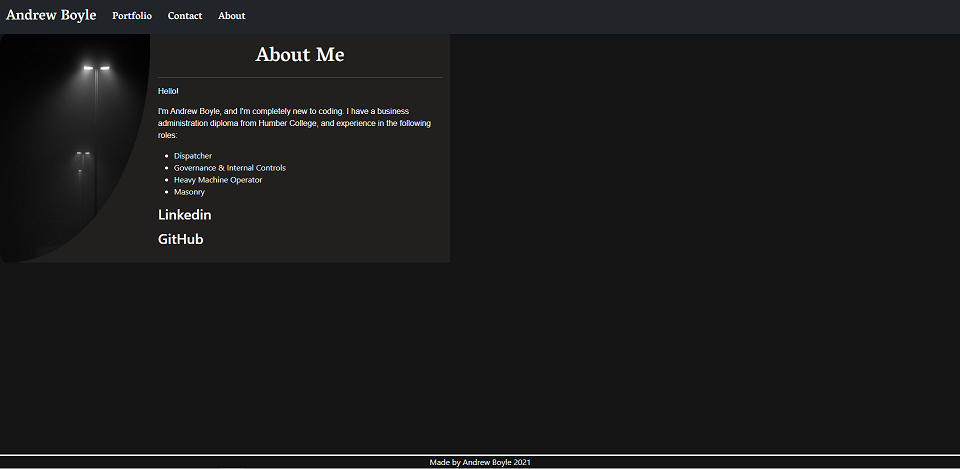
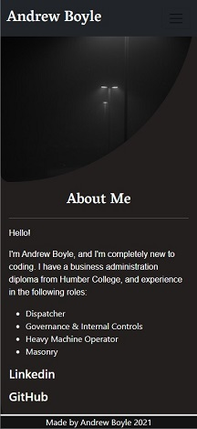
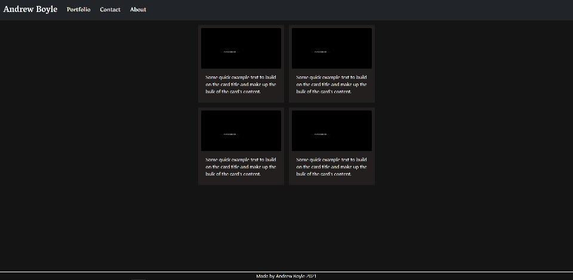
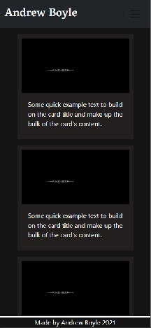
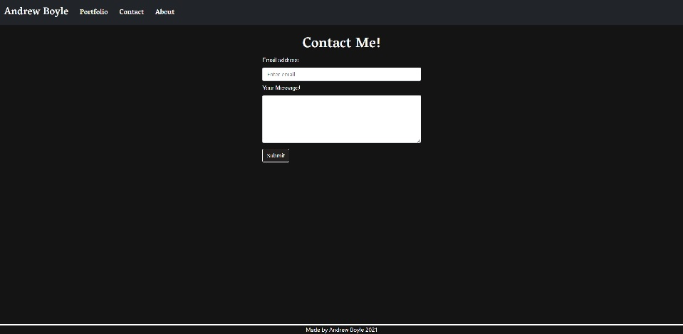
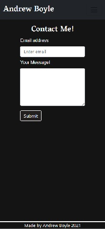

# Responsive Personal Website

    The main purpose of this project was to develop a personal website that is responsive.

   Goals for this project:
    
    * Fully responsive using Bootstrap
    * Functioning Navigation Bar on different pages
    * HTML Semantics
    * Functioning links

## Challenges

    The challenges that I had with this project was making the website responsive. I was not properly using bootstraps grid system. After some trial and error I was able to utilize bootstrap properly. 
     
 

 

 

## Project created by Andrew Boyle

# [Responsive Website](https://andyb2.github.io/website-responsive/)
